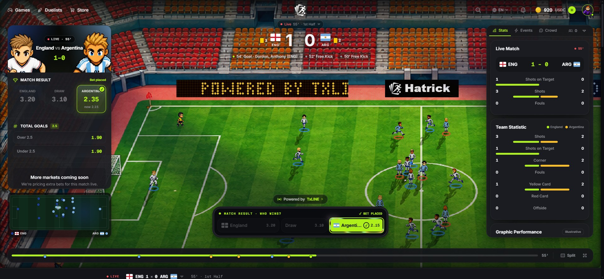
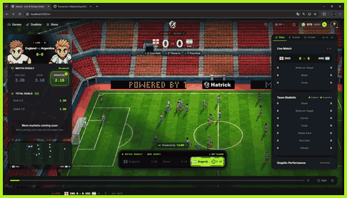
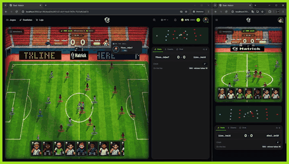
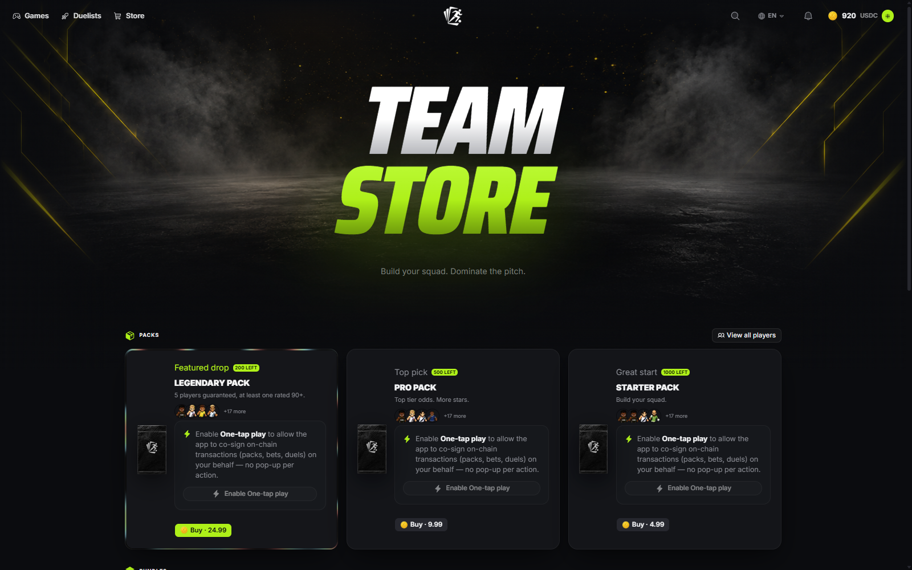
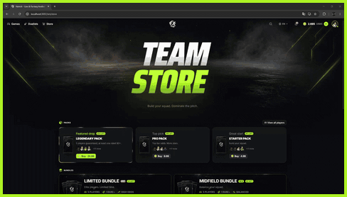
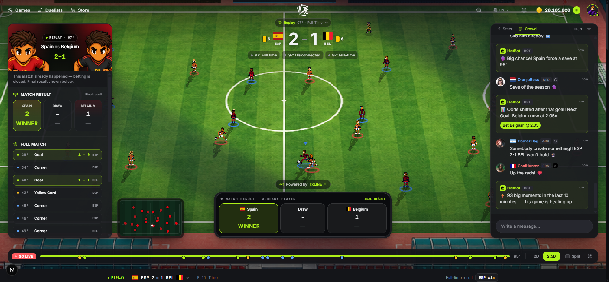
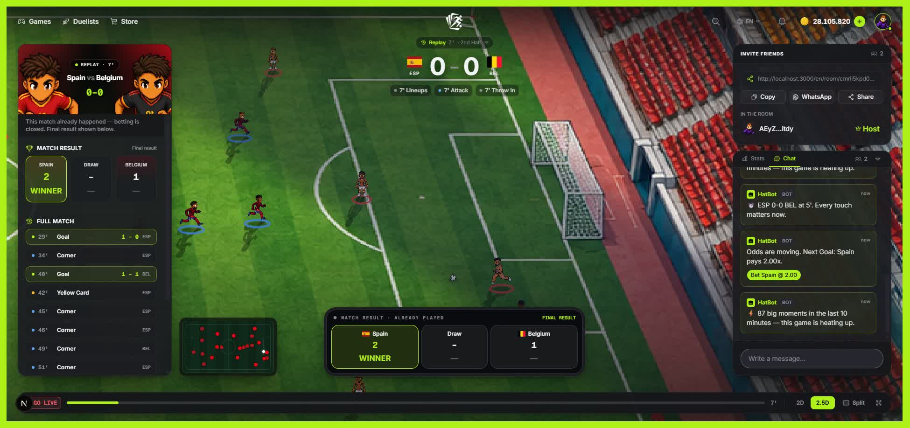

<a id="readme-top"></a>

<!-- PROJECT LOGO -->
<br />
<div align="center">
  <a href="https://github.com/project-hattrick/hat-trick">
    
  </a>

  <h1 align="center">Hatrick</h1>

  <p align="center">
    One platform, two ways to live the 2026 World Cup — simulated fantasy duels and a live 2D match arena, both driven by the same real-time data source: the <strong>TxLINE</strong> feed on <strong>Solana</strong>.
    <br />
    <a href="docs/technical-documentation.md"><strong>📄 Technical Documentation</strong></a>
    ·
    <a href="https://hatrick.xyz/style-guide" target="_blank">View Design System</a>
    ·
    <a href="https://github.com/project-hattrick/hat-trick/issues" target="_blank">Report Bug</a>
    ·
    <a href="https://github.com/project-hattrick/hat-trick/issues" target="_blank">Request Feature</a>
  </p>

  <p align="center">
    <a href="https://hatrick.xyz" target="_blank"><strong>🌐 Live — hatrick.xyz »</strong></a>
    ·
    <a href="https://x.com/playhatrick" target="_blank"><strong>Follow @playhatrick on X</strong></a>
  </p>

  <p align="center">
    <a href="https://github.com/project-hattrick/hat-trick/actions/workflows/ci.yml"></a>
    
    
    
    
  </p>
</div>

> [!IMPORTANT]
> Hackathon entry for the **TxODDS World Cup 2026 → Consumer & Fan Experiences** track. Devnet only, fictitious tokens — no real money moves. Not affiliated with FIFA; no official marks are used.

<div align="center">
  <!-- still capture — for extra punch, swap for a 3–5s GIF loop of the arena taking a goal (during → after) -->
  
</div>

<p align="center">
  <strong>104</strong> matches · <strong>1</strong> TxLINE feed · <strong>2</strong> modes · <strong>2 states</strong> per event (during / after)
</p>

## Evaluation Snapshot

Hatrick is designed to read as more than a demo: it is a consumer product loop where real-time sports data becomes play, social viewing, and settlement. The judging shortcut is simple:

- **Unique concept:** one TxLINE-powered engine drives both a live match arena and fantasy duels, instead of shipping another leaderboard, prediction widget, or chatbot.
- **Clear TxLINE dependency:** scores, events, odds, snapshots, replay, settlement, and fantasy progression all flow from the same provider-shaped pipeline.
- **Consumer-first UX:** email sign-in creates a Solana wallet invisibly, so a non-crypto fan can enter, get test funds, open packs, and place devnet bets without wallet setup friction.
- **Real-time credibility:** every event has a fast `during` state for animation and a confirmed `after` state for settlement, making responsiveness and trust visible in the product.
- **Business path:** Live betting margin, fantasy packs, market fees, and wallet retention form one economy instead of disconnected features.

<!-- TABLE OF CONTENTS -->
<details>
  <summary>Table of Contents</summary>
  <ol>
    <li><a href="#evaluation-snapshot">Evaluation Snapshot</a></li>
    <li>
      <a href="#about-the-project">About the Project</a>
      <ul>
        <li><a href="#the-two-modes">The Two Modes</a></li>
        <li><a href="#txline-feeds-modes">How TxLINE Feeds the Modes</a></li>
        <li><a href="#built-with">Built With</a></li>
      </ul>
    </li>
    <li><a href="#features">Features</a></li>
    <li>
      <a href="#getting-started">Getting Started</a>
      <ul>
        <li><a href="#prerequisites">Prerequisites</a></li>
        <li><a href="#installation">Installation</a></li>
      </ul>
    </li>
    <li><a href="#architecture">Data &amp; Architecture — powered by TxLINE</a></li>
    <li><a href="#track-fit">Track Fit — Consumer &amp; Fan Experiences</a></li>
    <li><a href="#apps">Apps</a></li>
    <li><a href="#roadmap">Roadmap</a></li>
    <li><a href="#compliance">Compliance</a></li>
    <li><a href="#license">License</a></li>
    <li><a href="#team">Team &amp; Contributors</a></li>
    <li><a href="#contact">Contact</a></li>
  </ol>
</details>

## About the Project

<div id="about-the-project"></div>

**Hatrick** turns the World Cup feed into a consumer game loop. Fans normally split their attention across score apps, fantasy tools, odds screens, and social feeds; Hatrick puts the core actions in one place: watch the match, bet the live market, collect cards, and play a squad duel.

### The Two Modes

<div id="the-two-modes"></div>

- **🎮 Fantasy** — open player packs, build your XI, and enter simulated 1v1 arena duels. Base cards are collectibles; live form and squad strength are informed by real player and team performance.
- **📺 Live** — follow real matches as a 2D arena with play-by-play, odds, and in-match betting on one screen.

> The defining mechanic: every event is emitted in **two states** — `during` (optimistic, animates instantly) and `after` (confirmed by TxLINE, authoritative). See [Architecture](#architecture).

### How TxLINE feeds the modes

<div id="txline-feeds-modes"></div>

TxLINE is the engine behind both modes, not just a logo in the footer.

| Mode | What TxLINE provides | What Hatrick turns it into |
|---|---|---|
| **Fantasy** | Player stats, lineups, goals, cards, shots, corners, final results, and confirmed `after` events | Card form, squad strength, duel inputs, player context, and replayable fantasy moments |
| **Live** | Real-time score events, match clock, play-by-play actions, odds updates, snapshots, and confirmed results | 2D arena motion, event feed, odds board, bet slip, settlement, and late-join state recovery |

The value is the same signed feed creating two products: Live makes the match watchable and bettable now; Fantasy keeps the fan economy active before, during, and after the match.

### Built With

<div id="built-with"></div>

[![TypeScript][ts-badge]][ts-url]
[![NestJS][nest-badge]][nest-url]
[![Next.js][next-badge]][next-url]
[![React][react-badge]][react-url]
[![Tailwind][tw-badge]][tw-url]
[![Solana][sol-badge]][sol-url]
[![Docker][docker-badge]][docker-url]

- **API:** NestJS · `@nestjs/event-emitter` (event-driven) · Socket.IO · Axios
- **Front:** Next.js (App Router) · shadcn/ui · Zustand · React Query · Solana Wallet Adapter · custom canvas game engine (framework-free TS)
- **Data:** TxLINE (SSE scores + odds, REST snapshots, oracle-signed settlement inputs) — see [Data & Architecture](#architecture)
- **Chain:** Solana (devnet) · Anchor programs for betting, fantasy duels, packs, and provably-fair seeds
- **Infra:** Docker (Postgres + Redis) · GitHub Actions CI

<p align="right">(<a href="#readme-top">Back to top</a>)</p>

## Features

<div id="features"></div>

<!-- FEATURE: Live mode + betting -->
<table width="100%">
<tr>
<td>

<h3>📺 Live mode + in-match betting</h3>

<p>Follow real matches as a <strong>2D real-time arena</strong> shaped by the TxLINE feed, with live odds and in-match bets settled by the <strong>authoritative</strong> result — optimistic <code>during</code> animation, confirmed <code>after</code> settlement, and 1X2 / Over-Under markets from the real odds feed.</p>

<div align="center">
  
</div>

</td>
</tr>
</table>

<!-- FEATURE: Fantasy 1v1 duel -->
<table width="100%">
<tr>
<td>

<h3>⚔️ Fantasy 1v1 duels</h3>

<p>Build your XI from the cards you own and stake in a <strong>simulated 1v1 arena duel</strong> rendered by the custom canvas engine. Card ratings and TxLINE-informed form seed the simulation — challenge a friend or get matched; the wager settles to the winner and the result is provable.</p>

<div align="center">
  
</div>

</td>
</tr>
</table>

<!-- FEATURE: Packs, cards & wallet (packs + store merged) -->
<table width="100%">
<tr>
<td colspan="2">

<h3>🃏 Packs &amp; cards · 🛒 store &amp; wallet</h3>

<p>Open packs to reveal player stickers — base rating, country, and rarity — each minted as a <strong>Metaplex Core NFT on Solana devnet</strong> (serial-numbered, capped supply, provably-fair pull), so your collection lives in your own wallet. A themed <strong>store</strong> and a single <strong>wallet</strong> tie both modes together: sign in with just an email and a Solana wallet is created invisibly (Privy), or connect Phantom.</p>

</td>
</tr>
<tr>
<td width="50%" valign="top"></td>
<td width="50%" valign="top"></td>
</tr>
<tr>
<td colspan="2">

<ul>
  <li>Base card identity stays fixed; live form is recomputed from TxLINE player and match stats.</li>
  <li>Cards feed the <strong>Fantasy 1v1</strong>, where real performance influences squad strength.</li>
  <li>Wager balance shows as a stablecoin ticker (devnet); betting is gated to wallet accounts, with compliance built in (18+, geo-block, self-exclusion).</li>
</ul>

</td>
</tr>
</table>

<!-- FEATURE: Live social — feed, chat, HatBot & rooms (crowd + rooms merged) -->
<table width="100%">
<tr>
<td colspan="2">

<h3>🗣️ Live social — feed, chat, HatBot &amp; 👥 watch-together rooms</h3>

<p>Every live match <em>and</em> Fantasy duel carries a social panel — <strong>Stats</strong>, a real-time <strong>Events</strong> feed (the full play-by-play, with player names), and <strong>Chat</strong>. <strong>HatBot</strong> jumps in on the big beats — goals, reds, penalties, VAR — the instant they land, and crowd moments surface as comic-style speech balloons over the stands. Prefer to watch with friends? Spin up an <strong>invite-only room</strong> — shared chat, social picks, and a match backdrop driven by the same feed.</p>

</td>
</tr>
<tr>
<td width="50%" valign="top"></td>
<td width="50%" valign="top"></td>
</tr>
<tr>
<td colspan="2">

<p><em>HatBot is a nicely-formatted feed of real events — by design not AI.</em></p>

</td>
</tr>
</table>

<p align="right">(<a href="#readme-top">Back to top</a>)</p>

## Getting Started

<div id="getting-started"></div>

A **polyglot monorepo of independent apps** — nothing shared, no cross-app imports. Run each app on its own.

### Prerequisites

<div id="prerequisites"></div>

- Node.js 20+
- Docker (for Postgres + Redis)
- (optional) A Solana wallet such as Phantom — email sign-in works without one
- Rust, Solana CLI 2.2.16, and Anchor 0.31.1 when building or deploying `contracts/`

### Installation

<div id="installation"></div>

```bash
# 1) API + infra (run from project/)
cd api
docker compose up -d                  # postgres :5432 + redis :6379
npm install                           # postinstall runs `prisma generate`
cp .env.example .env                   # set TXLINE_* to ingest live data
npm run prisma:deploy                  # apply migrations to a fresh DB
npm run start:dev                      # http://localhost:3001/health

# 2) Front (separate terminal)
cd front
npm install
cp .env.example .env.local
npm run dev                            # http://localhost:3000

# 3) Contracts (only when deploying or testing on-chain mode)
cd ../contracts
yarn install
anchor build --release
yarn test                              # local validator-backed Anchor tests
```

> The API boots cleanly with `TXLINE_ENABLED=false` and `SOLANA_ENABLED=false` (no credentials needed). See [`api/README.md`](api/README.md) for TxLINE and chain setup, and [`contracts/README.md`](contracts/README.md) for Anchor build/deploy instructions.

<p align="right">(<a href="#readme-top">Back to top</a>)</p>

## Data & Architecture — powered by TxLINE

<div id="architecture"></div>

Everything you see in Hatrick originates from **[TxLINE](https://txline.txodds.com)**, TxODDS' real-time World Cup data product. There is no scraped or invented match data: one feed, one ingest path, many consumers.

### Where the data comes from

| Source | What it carries | How we use it |
|---|---|---|
| **TxLINE SSE — scores** | Live match events (goals, cards, corners, possession…) with a `confirmed` flag | The heartbeat of the whole app |
| **TxLINE SSE — odds** | Real-time market prices | Odds boards + in-match betting markets |
| **TxLINE REST snapshots** | Fixtures, lineups, current state | Fixture pages, initial state on connect |
| **Solana devnet** | TxLINE token activation plus Hatrick Anchor programs for betting, fantasy duels, card packs, and provably-fair seeds | Access to the feed is provisioned on-chain; app flows can run in play-money mode or chain-authoritative mode |

### One feed, two states, many consumers

```
TxLINE SSE (scores + odds)
        ▼
[api] ingest → normalizer ──emits──►  *.during (confirmed=false → optimistic, animate now)
        │   in-memory state           *.after  (confirmed=true  → authoritative, settle & recompute)
        ▼
   EventEmitter2 ─► listeners (fantasy attributes · live markets · settlement)
        ▼
[api] WebSocket gateway ──► [front] one WS → Zustand stores → surfaces
```

The core contract: **every domain event fires twice**. `*.during` is the optimistic read (TxLINE `confirmed=false`) — it drives instant animation. `*.after` is the authoritative read (`confirmed=true`) — it settles bets, recomputes fantasy attributes, and locks the score. The UI feels instant *and* trustworthy because those are two different events, not one guess.


### What the feed drives on screen

- **Live:** score events animate the arena; odds updates price the board; confirmed results settle bets.
- **Fantasy:** player/team performance updates card form and squad strength after confirmed events.
- **Replay:** finished matches run through the same pipeline, so demos show real TxLINE behavior without waiting for kickoff.

> 📄 **Go deeper — full technical documentation.** The complete writeup lives in **[`docs/technical-documentation.md`](docs/technical-documentation.md)**: the event-driven architecture, the full list of TxLINE endpoints we use, the wire-format gotchas we solved (score truth, regulation vs. extra time, naming events, gap-filling), and how the four Solana programs handle betting, duels, packs, and provably-fair seeds.

<p align="right">(<a href="#readme-top">Back to top</a>)</p>

## Track Fit — Consumer & Fan Experiences

<div id="track-fit"></div>

How Hatrick answers each judging criterion of the track:

| Criterion | How Hatrick answers it |
|---|---|
| **Fan Accessibility & UX** | One platform instead of three tabs: watch, play, and bet share one profile, wallet, and design system. Two clear modes from a single home; built for a non-technical fan. |
| **Real-Time Responsiveness** | The during/after contract makes latency a feature: the arena animates the instant an event arrives (`*.during`) and reconciles when TxLINE confirms it (`*.after`). One SSE ingest → WebSocket fan-out to every surface. |
| **Originality & Value Creation** | Not another picks leaderboard or pundit bot — a **playable match simulation** driven by real data. Live matches become a 2D arena; fantasy cards get stronger from real performances; both are the same engine fed by the same feed. |
| **Commercial & Monetization Path** | A closed economy with real monetization hooks: betting margin (Live), pack sales and market fees (Fantasy), and a wallet ledger connecting them. Responsible gaming built in (18+ gate, self-exclusion, stake limits) — table stakes for anything odds-adjacent. |
| **Completeness & Execution** | Functional end-to-end today: on-chain TxLINE token activation, four Anchor programs, live ingest, betting with settlement, pack → XI → 1v1 duels, replay for demos. Devnet, no real money. |

And the hard requirements: **TxLINE as live input** ✅ · **Solana sign-up** ✅ (wallet = Competitor account) · **functional product, not a mockup** ✅ · public repo + ≤5-min demo video with the submission.

> 🔗 **Proof it's on-chain:** program ids, deploy commands, and verification steps live in [`contracts/README.md`](contracts/README.md) — and every pack buy, bet, and settlement in the app links straight to Solscan (devnet).

<p align="right">(<a href="#readme-top">Back to top</a>)</p>

## Apps

<div id="apps"></div>

| App | Stack | Port | Status |
|---|---|---|---|
| [`api/`](api) | NestJS, event-driven (TxLINE → DURING/AFTER → WebSocket) | 3001 | active |
| [`front/`](front) | Next.js (App Router) + shadcn/ui + Zustand + React Query | 3000 | active |
| [`contracts/`](contracts) | Anchor / Solana (devnet): betting, fantasy, packs, provably-fair seeds | — | active |

```text
project/
├─ api/        # NestJS — event-driven, TxLINE ingest, WS gateway (+ docker-compose)
├─ front/      # Next.js — shadcn, Zustand, React Query, services/
└─ contracts/  # Anchor / Solana — betting, fantasy duels, packs, provably-fair seeds
```

<p align="right">(<a href="#readme-top">Back to top</a>)</p>

## Roadmap

<div id="roadmap"></div>

- [x] Monorepo scaffold (api + front), governance docs, CI, Docker infra
- [x] Event-driven core with the `during` / `after` contract
- [x] **TxLINE integration** — on-chain token activation, SSE ingest, snapshots, match **replay** through the live pipeline
- [x] **Live Mode** — feed-driven 2D arena, live odds board, markets, in-match betting + settlement
- [x] **Fantasy Mode** — packs, XI builder, dynamic attributes, 1v1 arena duels
- [x] Responsible gaming — 18+ age gate, self-exclusion, stake limits
- [x] Geo-blocking on betting surfaces (`proxy.ts`, `?geo=demo` bypass)
- [x] **Contracts** — Anchor programs for betting escrow, fantasy duel escrow, card packs, and provably-fair seeds
- [x] **Public deploy** — live at [hatrick.xyz](https://hatrick.xyz) + demo video with the submission
- [x] On-chain proof — Solscan receipts for pack buys, bets, and settlements (devnet)
- [x] **Live social feed** — real-time Events play-by-play with player names, HatBot reactions on the big beats, and live viewer picks across Live and Fantasy
- [ ] **More matches & leagues** — grow past the World Cup into TxODDS' wider catalog (350+ leagues, 30+ sports); ingest is league-agnostic, so activating a competition is config (`POST /token/activate {leagues}`), not a rewrite
- [ ] **Crowd at scale** — multi-user chat with moderation & ranking, plus X-style social balloons

<p align="right">(<a href="#readme-top">Back to top</a>)</p>

## Compliance

<div id="compliance"></div>

- **No FIFA IP** — no official branding, logos, marks, or implied affiliation.
- **Devnet only** — fictitious tokens; no real-money movement during the hackathon.
- **Geo-blocking** — betting surfaces restrict regulated jurisdictions.
- **Natural-person authorship** — AI used as a tool; a human team owns the submission.

<p align="right">(<a href="#readme-top">Back to top</a>)</p>

## License

<div id="license"></div>

Distributed under the **MIT License**. See `LICENSE.txt` for details once the license file is added to the repository.

<p align="right">(<a href="#readme-top">Back to top</a>)</p>

## Team & Contributors

<div id="team"></div>

<table>
  <tr>
    <td align="center">
      <a href="https://github.com/Kc1t">
        <br />
        <sub><b>Kauã Miguel</b></sub>
      </a><br />
      <sub>Owner · <a href="https://github.com/Kc1t">@Kc1t</a></sub>
    </td>
    <td align="center">
      <a href="https://github.com/eudehh">
        <br />
        <sub><b>Deborah Pavanelli Colicchio</b></sub>
      </a><br />
      <sub>Member · <a href="https://github.com/eudehh">@eudehh</a></sub>
    </td>
    <td align="center">
      <a href="https://github.com/opedrooz">
        <br />
        <sub><b>Pedro Henrique</b></sub>
      </a><br />
      <sub>Member · <a href="https://github.com/opedrooz">@opedrooz</a></sub>
    </td>
  </tr>
</table>

<p align="right">(<a href="#readme-top">Back to top</a>)</p>

## Contact

<div id="contact"></div>

Team Hatrick · X: [@playhatrick](https://x.com/playhatrick) · Repository: [https://github.com/project-hattrick/hat-trick](https://github.com/project-hattrick/hat-trick)

<p align="right">(<a href="#readme-top">Back to top</a>)</p>

<!-- BADGE LINKS -->
[ts-badge]: https://img.shields.io/badge/TypeScript-3178C6?style=for-the-badge&logo=typescript&logoColor=white
[ts-url]: https://www.typescriptlang.org/
[nest-badge]: https://img.shields.io/badge/NestJS-E0234E?style=for-the-badge&logo=nestjs&logoColor=white
[nest-url]: https://nestjs.com/
[next-badge]: https://img.shields.io/badge/Next.js-000000?style=for-the-badge&logo=nextdotjs&logoColor=white
[next-url]: https://nextjs.org/
[react-badge]: https://img.shields.io/badge/React-20232A?style=for-the-badge&logo=react&logoColor=61DAFB
[react-url]: https://react.dev/
[tw-badge]: https://img.shields.io/badge/Tailwind-06B6D4?style=for-the-badge&logo=tailwindcss&logoColor=white
[tw-url]: https://tailwindcss.com/
[sol-badge]: https://img.shields.io/badge/Solana-14F195?style=for-the-badge&logo=solana&logoColor=black
[sol-url]: https://solana.com/
[docker-badge]: https://img.shields.io/badge/Docker-2496ED?style=for-the-badge&logo=docker&logoColor=white
[docker-url]: https://www.docker.com/
